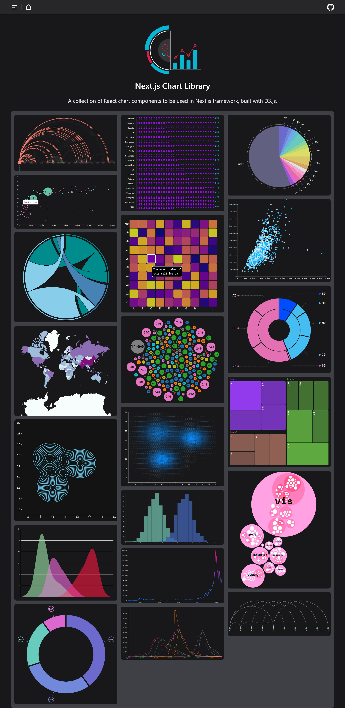
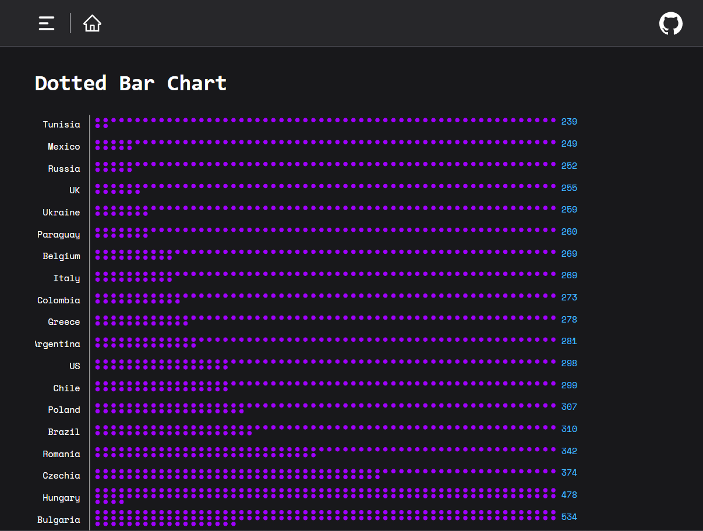
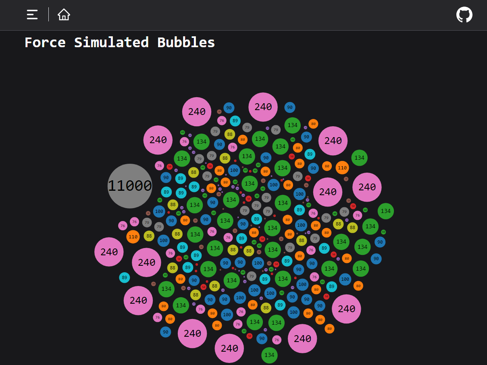
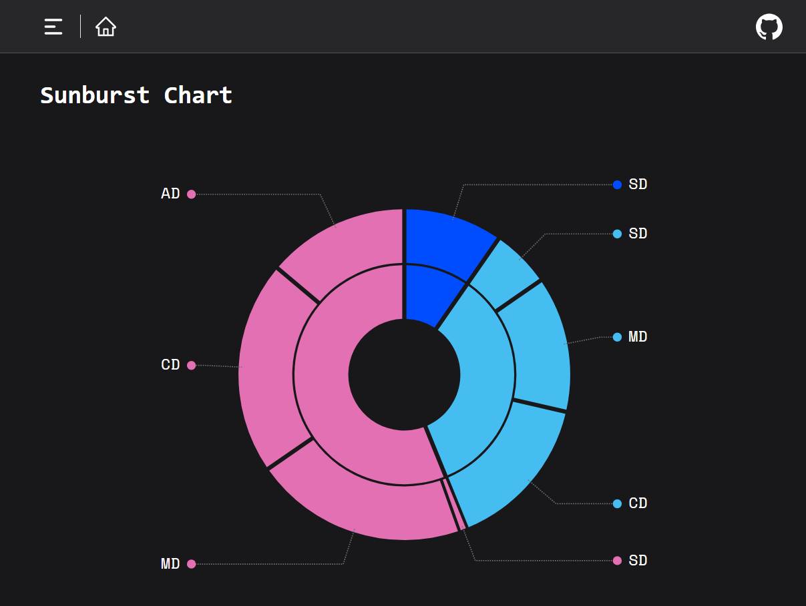
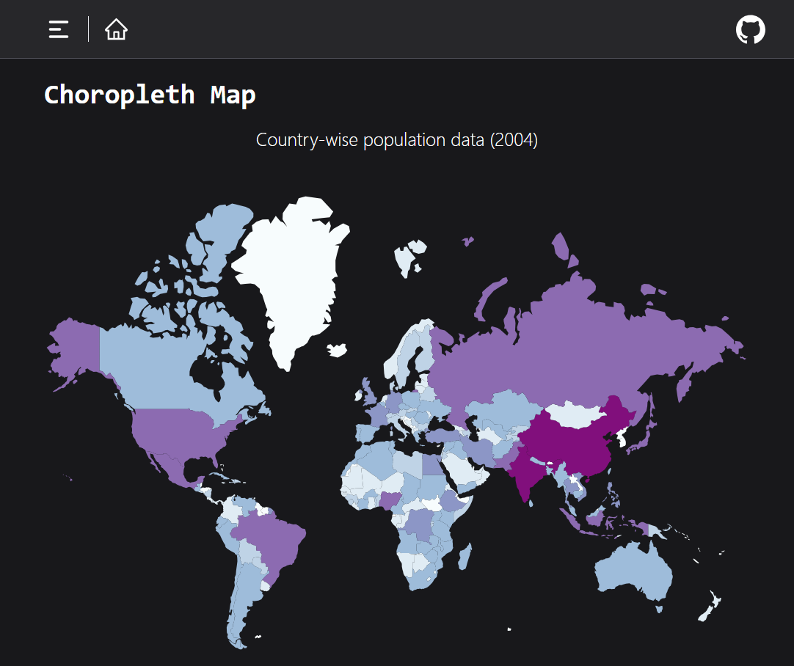
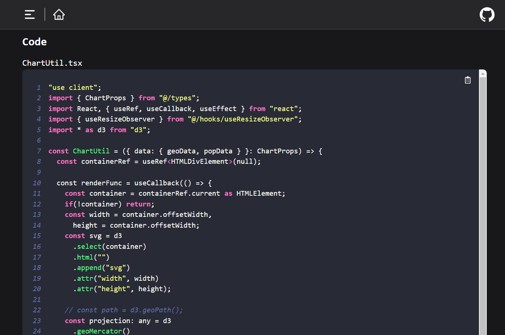

# Next Chart Library

**A collection of D3.js chart components to be used in Next.js framework for quick prototyping.**

## Built with:
   

## Screenshots: 
     

## Acknowledgements
 - Quite many charts were used from the awesome [D3 Chart Gallery](https://d3-graph-gallery.com/about.html)
 - For easy readme formatting: [readme.so](https://readme.so/)

## Authors

- [@prateek-k0](https://github.com/prateek-k0)